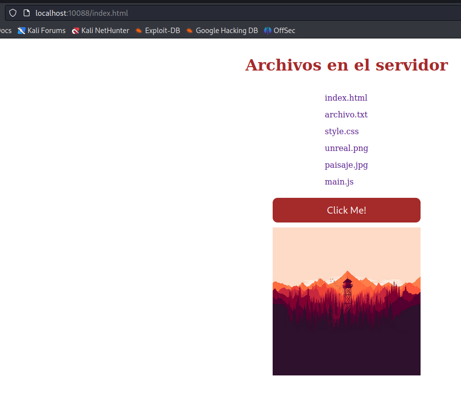

# Servidor HTTP Simple

## Descripción y características
* El proyecto consiste en un servidor HTTP simple que recibe peticiones GET.
* El servidor escucha en el puerto 10080 y espera conexiones de clientes. 
* Una vez que un cliente se conecta, el servidor recibe la petición GET y envía el archivo solicitado.
* El servidor puede enviar archivos de texto y de imagen.
* El servidor puede enviar archivos de cualquier tamaño.
* El servidor puede enviar archivos de cualquier tipo.
* El servidor puede enviar archivos que se encuentren en cualquier subcarpeta.

## Estructura del proyecto
El proyecto está escrito en C y usa CMake para la compilación. El código una vez compilado genera los siguientes ejecutables:

Ejecutable:
- `server`: Servidor HTTP simple. 


## Instalación y compilación

Para compilar este proyecto, basta con seguir los pasos habituales para un proyecto con CMake:

```console
$ mkdir build
$ cd build
$ cmake ..
$ make
```

## Prueba de ejemplo (Estar dentro de la carpeta build)
```bash
# Ejecutar servidor
$ ./server
# Acceder al navegador y escribir la siguiente dirección: localhost:10080/index.html
```
## Imagen de prueba



## Autores
* **Martín Isla** 
* **Daniel López**


